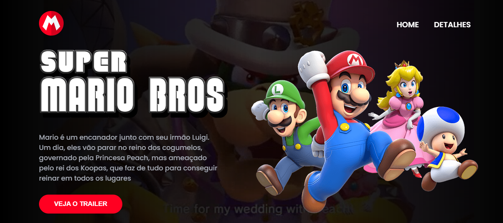

# Projeto Mario Bros

 

## Sobre o Projeto

Esse projetinho foi realizado durante a **Semana Do Zero ao Programador Contratado** ofertado pelo **Dev em Dobro**. Para visualizar  o oficial, acesse o link <https://github.com/devemdobro/projeto-mario> . 

 

***
 

## Tecnologias Utilizadas

- [x] HTML
- [x] CSS
- [x] JAVASCRIPT

 

***
 

## Como rodar esse Projeto

 
Na pasta desejada copie o código abaixo :

 

~~~
git clone https://github.com/mari-moreira/Projeto-Mario-Bros 
~~~

